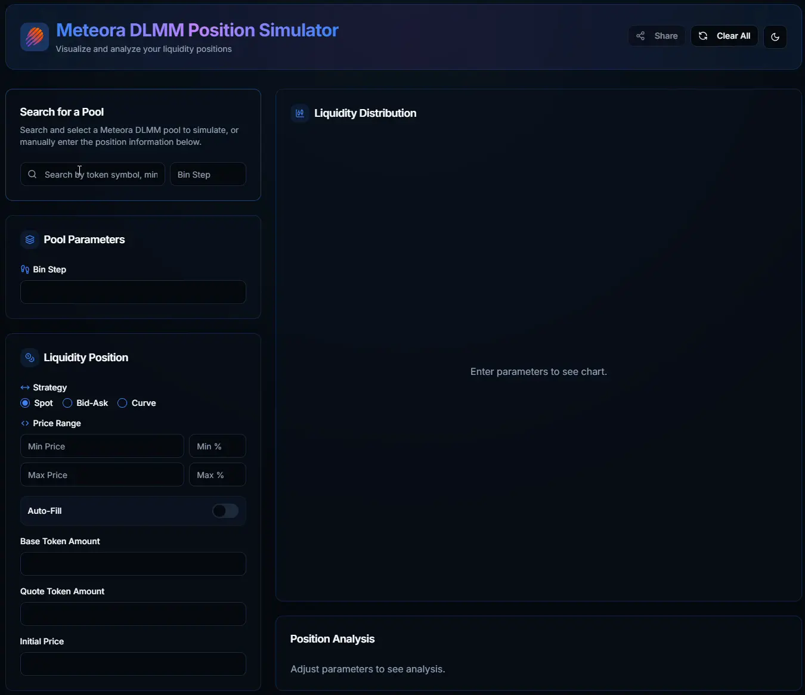
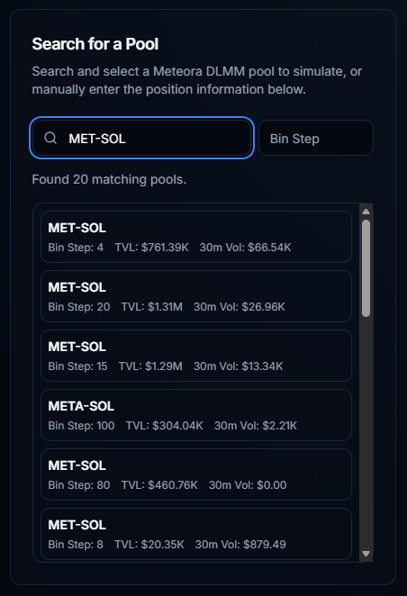
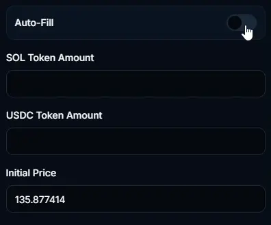
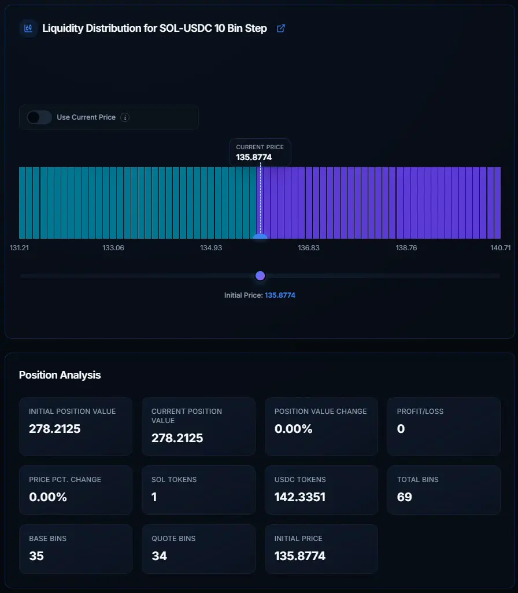

# Meteora DLMM Position Simulator

Try it live at [https://dlmmsim.xyz](https://dlmmsim.xyz)

The Meteora DLMM Position Simulator is very simple to use. Just fill in the
input fields to the left, according to the position you wish to simulate. The
liquidity distribution display allows you to drag the current price to the left
and right, to simulate what will happen to the position value when the price
changes. This is a great tool for beginners to see how price will affect the
total value of their liquidity as the price moves up and down.

## Features

### Search for Real Meteora DLMM Pools

Search and select from live Meteora DLMM pools to instantly load real market
data into the simulator. This allows you to simulate positions based on actual
pool configurations and current market conditions.

### Autofill Balanced Positions

Create balanced positions effortlessly by entering the amount for just one
token. The simulator automatically calculates the corresponding amount for the
other token based on your selected price range and distribution strategy.

### Interactive Price Simulation

Move the current price slider to see real-time updates on how price movements
will affect your position value. Watch as tokens convert between base and quote
across different price bins, and see instant profit/loss calculations.

### Share Position Strategies

Share your position configurations and strategies with others through shareable
links. Perfect for discussing strategies, teaching, or collaborating on
liquidity provision approaches.

### Light Mode / Dark Mode Toggle

Switch between light and dark themes to match your preference and reduce eye
strain during extended analysis sessions.

