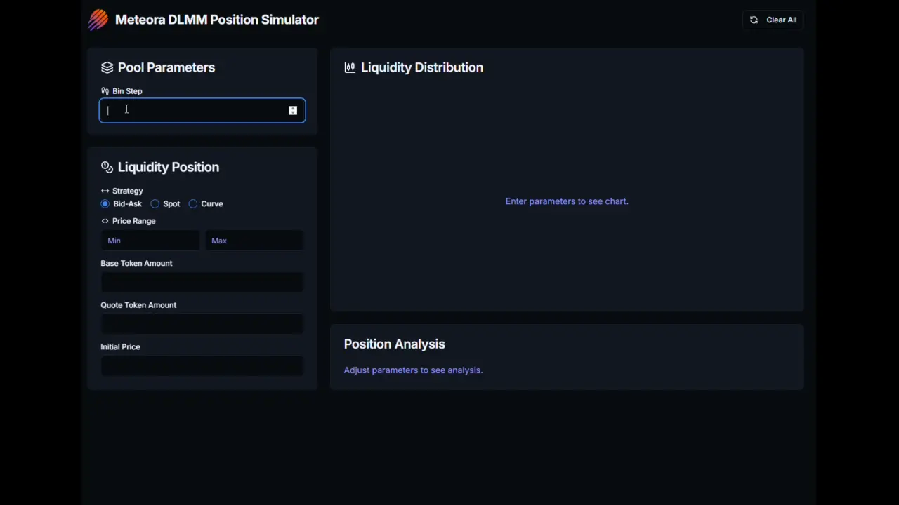

# Meteora DLMM Position Simulator

The Meteora DLMM Position Simulator is very simple to use.  Just fill in the 
input fields to the left, according to the position you wish to simulate.  The 
liquidity distribution display allows you to drag the current price to the left 
and right, to simulate what will happen to the position value when the price 
changes. This is a great tool for beginners to see how price will affect the 
total value of their liquidity as the price moves up and down.