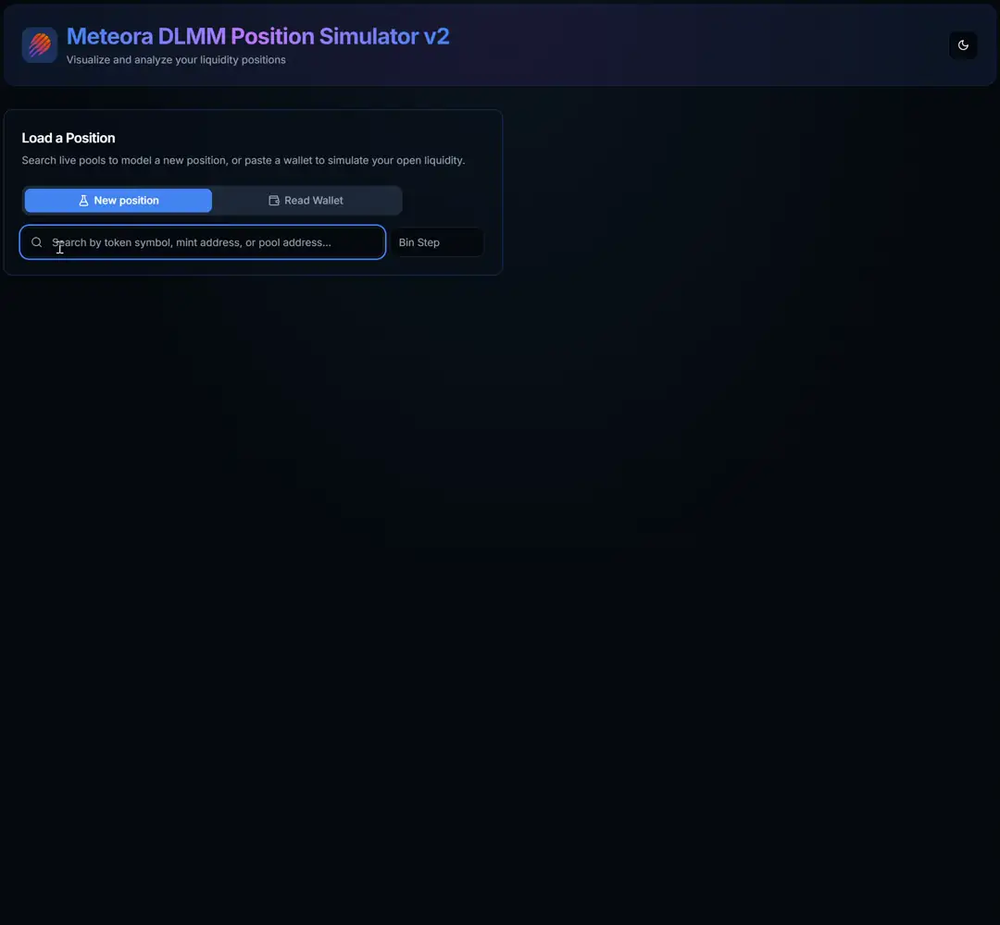

# Meteora DLMM Position Simulator v2

Try it live at [https://dlmmsim.xyz](https://dlmmsim.xyz)



Version 2 is a position workshop on top of the original price simulator. Start from a live Meteora DLMM pool or from a wallet's open liquidity, then add, remove, and stack positions while you move price through the bins. The chart and analysis update as tokens convert between base and quote, so you can see how range, strategy, and price path change position value. On a phone, Positions and Analysis are separate tabs.

## Features

### Search Live Pools

On the **New position** tab, search live Meteora DLMM pools by token symbol, mint, or pool address. Filter by bin step, then pick a pool to load its current price, token names, and decimals into the simulator.

### Load Open Positions from a Wallet

Switch to **Read Wallet**, paste a Solana address, and load every open DLMM position. Positions are grouped by trading pair (for example SOL-USDC). Open a pair to see the pools you have liquidity in — the same pair can have several pools with different bin steps and fees — then simulate **all of that pool's positions combined**. If a pair only has one pool, that simulation opens automatically.

After a wallet load, set the **initial price** on the Analysis chart. That price is the cost basis for the loaded positions and locks after the first simulated transaction.

Share URLs include the pool, wallet (when loaded), simulated price, and any simulated positions or liquidity changes. On-chain wallet positions are not baked into the link — they are read from current chain data when the link is opened.

### Create Positions with a Range Editor

After a pool is selected, the Meteora-style range editor sets min and max price, bin count, and distribution strategy (**Spot**, **Bid-Ask**, or **Curve**). Drag the range handles, step bins with +/−, or type prices and percents. New positions default to a 70-bin range. Liquidity is shaped at the simulated current price: one-sided quote sits at or below that price, one-sided base at or above. Entering both token amounts centers the range on the price; clearing one amount reshapes to a one-sided deposit.

On the first position, drag the vertical **initial price** bar in the distribution preview. Pull it outside the min/max handles for a one-sided deposit. That initial price is the cost basis until the first simulated transaction.

Turn on **Auto-Fill** and enter the amount for one token. The range recenters to a two-sided deposit and the other amount is calculated from the strategy and current price so the deposit stays balanced.

### Adjust Position to Break Even

When earlier simulated removals leave a realized loss, **New position** can offer **Adjust position to break even**. Turn it on to set the range top to the smallest price where the portfolio — open positions plus pocketed funds — is together worth the **net investment** again (the fresh capital put in; redepositing previously withdrawn tokens does not change it) — and size the deposit so that still holds after the position is opened.

While the mode is on:

- Changing strategy or token amounts re-solves the range top (and deposit size) to that breakeven.
- Editing the range re-solves the base amount needed to break even at the new top.

Use it together with reinvesting removed base (below) when you want a reopened range aimed at recovering a simulated loss.

### Reinvest Removed Base

After a simulated removal frees base tokens that are not yet redeployed, deposit forms show **Reinvest removed {base}**. **Use max** fills the base field with the net reclaimable amount (with an approximate quote value at the current simulated price). If **Adjust position to break even** is also on, the range top updates for that reinvested size.

### Add, Remove, and Stack Liquidity

Each position in the list can add liquidity, remove liquidity, or — for simulated positions — be edited or deleted. **New** opens another position on the same pool so you can stack ranges. Wallet loads also offer **Restore original** to undo simulated transactions.

Removals can target a bin range, not only a percent of the whole position. Drag the highlighted span, pick 50% or 100%, or use the slider. **Remove only** buttons (token icon and symbol) select every bin that currently holds just that token, so you can withdraw one side of the position. The preview shows which tokens come out and the realized gain or loss at the simulated price.

Adds and new positions use the **current simulated price** as the deposit price when it differs from the simulation’s starting price; the form notes that adjustment.

A **simulated transaction log** records every add, remove, and new position so you can edit or drop individual steps. Removals lock in realized P&L; later price moves do not change those closed lots. Combined Analysis profit/loss includes remaining mark-to-market plus that realized P&L.

### Interactive Price Simulation

Drag the pool-price handle, or use the **Price shock** shortcuts (−25% through +25%) to jump. Bins convert between base and quote as price crosses them. **Reset to Initial** returns the simulated price to the cost-basis initial price.

The initial price is editable until the first simulated transaction, then it locks (triangle marker under the axis). Analysis shows:

- **Net investment** — the fresh capital put in: every deposit minus the value of tokens redeposited from earlier removals. Withdrawals never reduce it; the withdrawn tokens still belong to the user as pocketed cash.
- **Position value** vs **Pocketed value** — what is still deployed in positions versus what was withdrawn and held (the pocketed stat only appears when funds sit outside positions). Together they make up **Current value**, the whole portfolio.
- Value change of the portfolio against the net investment
- P&L breakdown: **Unrealized** (open positions vs their cost), **Realized** (locked in by removals), and **Net** (their sum — portfolio value against the net investment)
- Token balances and price change
- **Breakeven** — first liquidity bin where the portfolio reaches the net investment, or N/A if unreachable within the position
- Average price paid or sold
- Bin counts by side (base vs quote)

### Share Position Strategies

Copy a shareable link for the current simulation: pool, price, and every simulated position or liquidity change. Wallet links re-load live on-chain positions, then replay the simulated overlay on top. Useful for comparing strategies or walking someone through a setup.

### Light Mode / Dark Mode

Toggle between light and dark themes from the header.

## Development

```bash
npm install
npm run dev        # http://localhost:9002 (Turbopack)
npm run build      # static export
npm run typecheck
npm run lint
```
