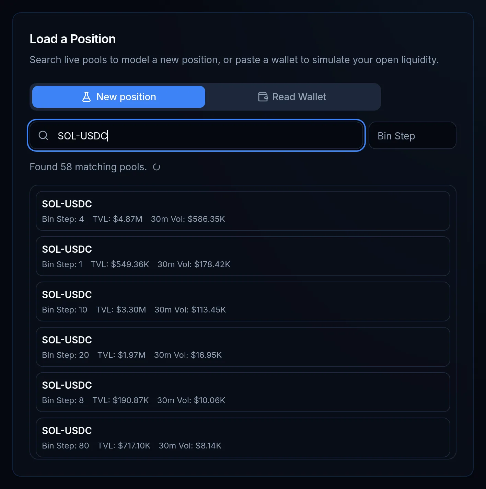
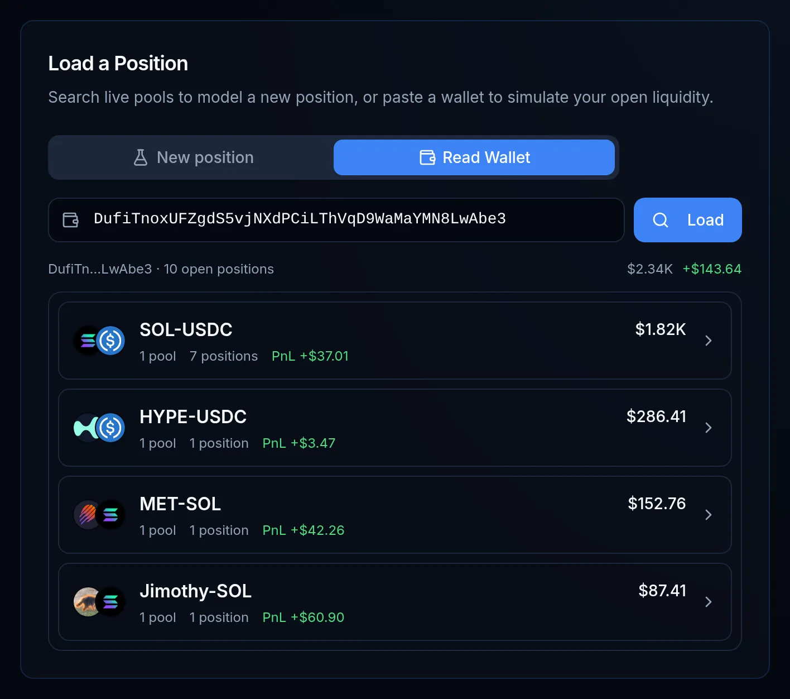
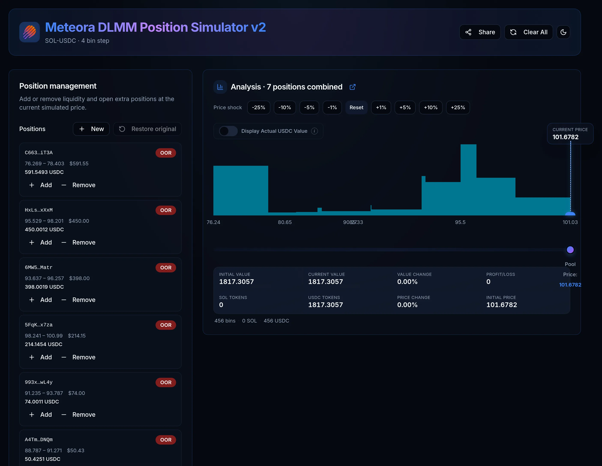
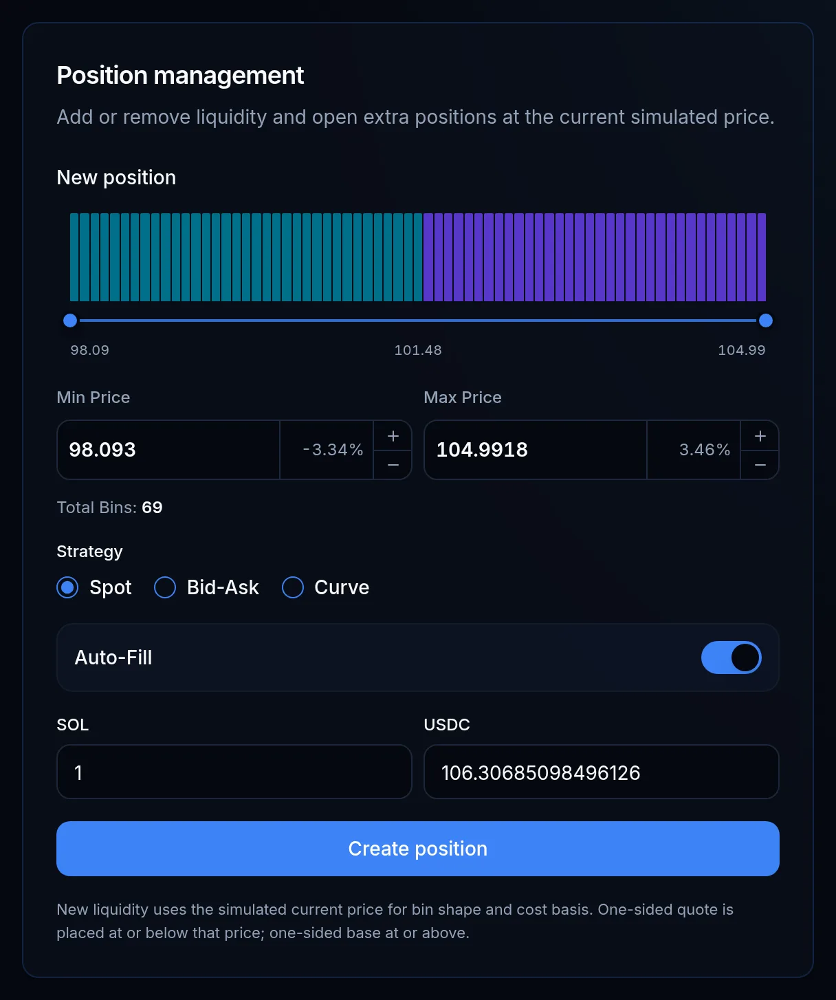
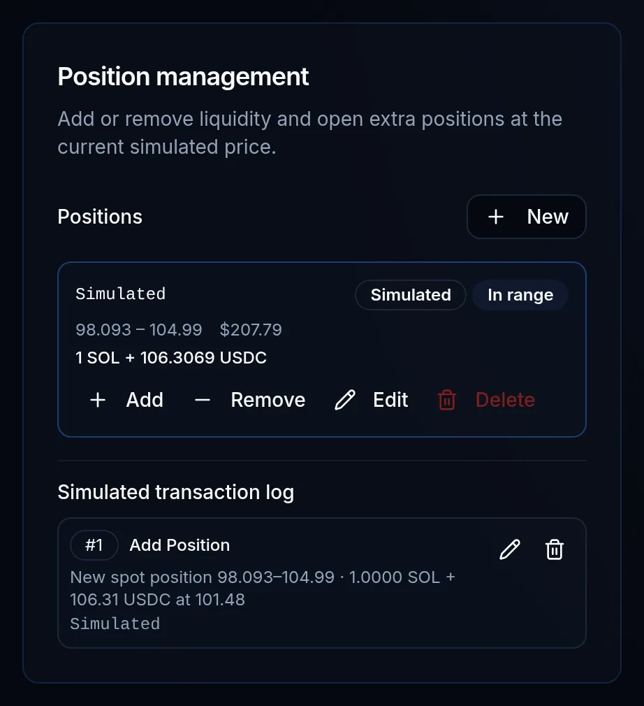
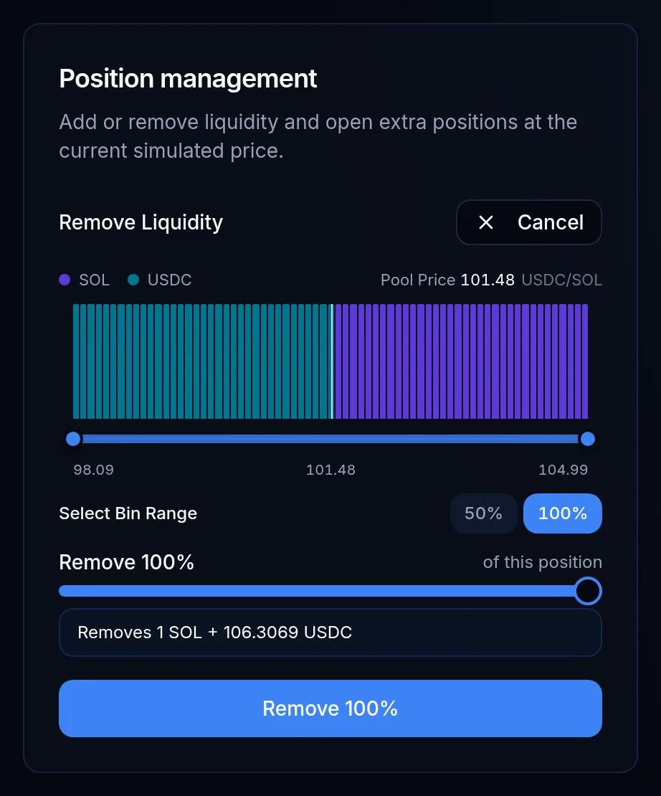
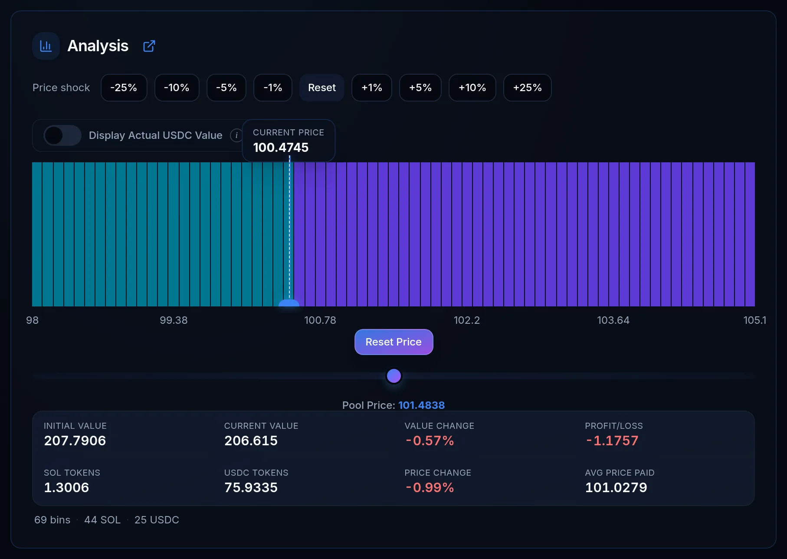
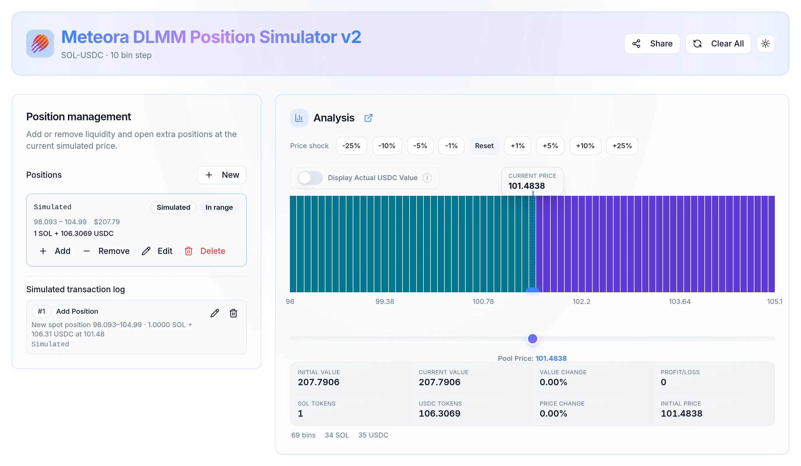

# Meteora DLMM Position Simulator v2

Try it live at [https://dlmmsim.xyz](https://dlmmsim.xyz)

Version 2 is a position workshop on top of the original price simulator. Start from a live Meteora DLMM pool or from a wallet's open liquidity, then add, remove, and stack positions while you move price through the bins. The chart and analysis update as tokens convert between base and quote, so you can see how range, strategy, and price path change position value. On a phone, Positions and Analysis are separate tabs.

## Features

### Search Live Pools

On the **New position** tab, search live Meteora DLMM pools by token symbol, mint, or pool address. Filter by bin step, then pick a pool to load its current price, token names, and decimals into the simulator.

### Load Open Positions from a Wallet

Switch to **Read Wallet**, paste a Solana address, and load every open DLMM position. Positions are grouped by trading pair (for example SOL-USDC). Open a pair to see the pools you have liquidity in — the same pair can have several pools with different bin steps and fees — then simulate **all of that pool's positions combined**. If a pair only has one pool, that simulation opens automatically.

Share URLs include the pool, wallet (when loaded), simulated price, and any simulated positions or liquidity changes. On-chain wallet positions are not baked into the link — they are read from current chain data when the link is opened.

### Create Positions with a Range Editor

After a pool is selected, the Meteora-style range editor sets min and max price, bin count, and distribution strategy (**Spot**, **Bid-Ask**, or **Curve**). Drag the range handles, step bins with +/−, or type prices and percents. New liquidity is shaped at the simulated current price: one-sided quote sits at or below that price, one-sided base at or above.

Turn on **Auto-Fill** and enter the amount for one token. The other amount is calculated from the range, strategy, and current price so the deposit stays balanced.

### Add, Remove, and Stack Liquidity

Each position in the list can add liquidity, remove liquidity, or — for simulated positions — be edited or deleted. **New** opens another position on the same pool so you can stack ranges. Wallet loads also offer **Restore original** to undo simulated transactions.

Removals can target a bin range, not only a percent of the whole position. Drag the highlighted span, pick 50% or 100%, or use the slider. The preview shows exactly which tokens come out.

A **simulated transaction log** records every add, remove, and new position so you can edit or drop individual steps.

### Interactive Price Simulation

Drag the pool-price handle, or use the **Price shock** shortcuts (−25% through +25%) to jump. Bins convert between base and quote as price crosses them. Analysis shows initial vs current value, profit/loss, token balances, price change, and average price paid or sold.

### Share Position Strategies

Copy a shareable link for the current simulation: pool, price, and every simulated position or liquidity change. Wallet links re-load live on-chain positions, then replay the simulated overlay on top. Useful for comparing strategies or walking someone through a setup.

### Light Mode / Dark Mode

Toggle between light and dark themes from the header.

